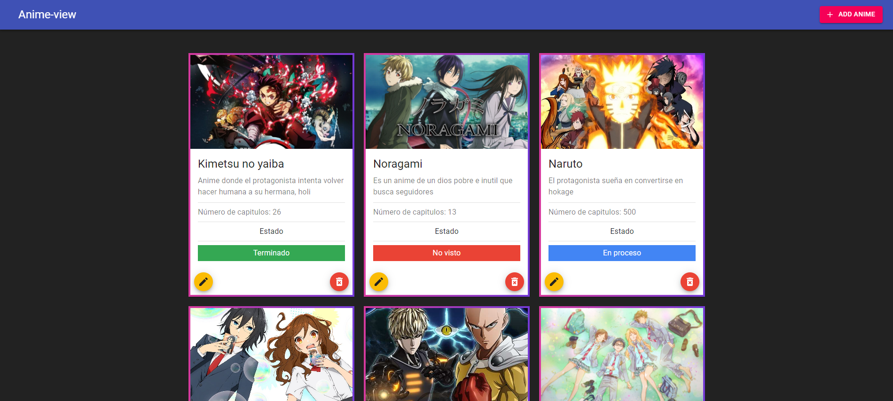
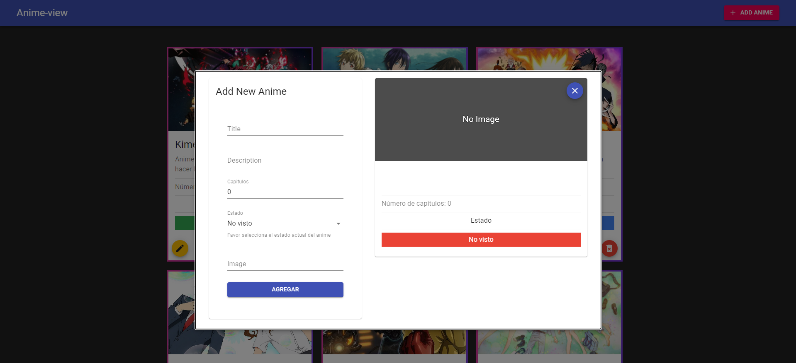

# React-App-Anime

Ejemplo básico de app creada con react, es un tipo de directorio de anime básico. CRUD sencillo en donde se toma en cuenta elementos importantes de react.





En este proyecto se utilizó json-server para simular un backend minimalista el cual está dentro del mismo proyecto.

Ejecutar los siguientes comandos dentro del proyecto para iniciar app:
### Inicio de Frontend
```
npm start
```

### Inicio de Backend
```
npm run server
```